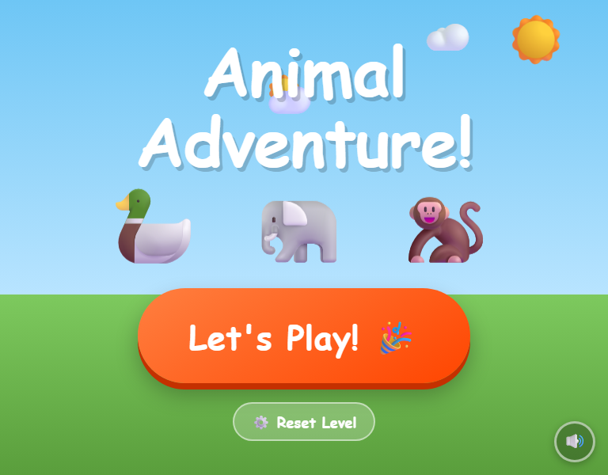
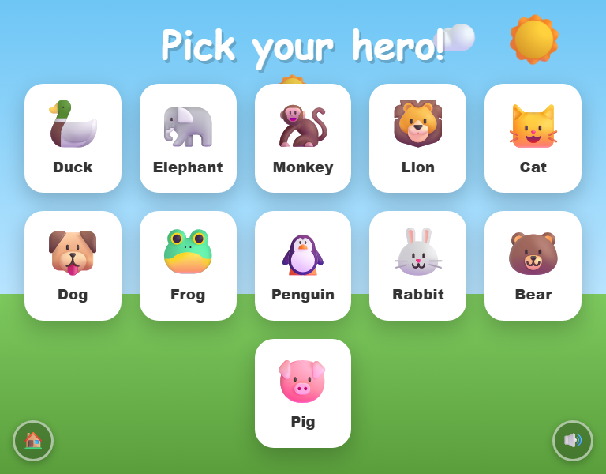
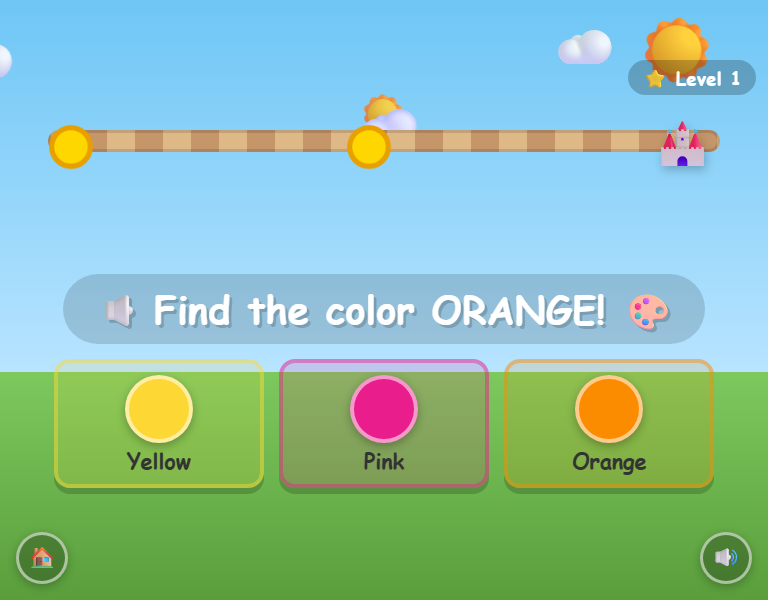
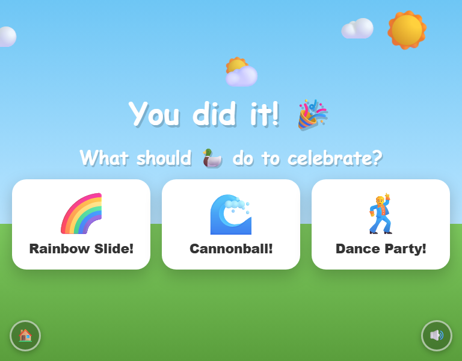

# Animal Academy

A browser-based learning game for toddlers — pick an animal hero, answer questions about colors, shapes and numbers, and walk your way to a fun Grok-generated celebration video.

Runs entirely offline from a single HTML file — no server, no build step, no dependencies. Designed for iPad in full-screen browser mode.

---



---

## Demo

https://runestone0.github.io/AnimalAcademy/src/

---
## How to play

1. Tap **Let's Play!** and listen to the introduction
2. Pick one of 11 animal heroes
3. Answer questions about colors, shapes, and numbers
4. Each correct answer moves your animal one step closer to the destination
5. Win all the steps, pick a celebration — and watch a Grok-generated video made just for you!

---

## Screenshots

| Pick your hero | Play |
|---|---|
|  |  |



---

## Setup

### 1. Add your xAI API key

The game uses [xAI Grok](https://console.x.ai/) for voice (TTS) and win-screen video generation.

```bash
cp config.example.js config.js
```

Then open `config.js` and replace the placeholder with your real key:

```js
const GROK_API_KEY = 'your-xai-api-key-here';
```

### 2. Open the game

Double-click `index.html` to open it directly in a browser, or serve it locally:

```bash
python -m http.server 3456
# then open http://localhost:3456
```

> **Note:** A local server is required for the xAI API calls to work (browsers block outgoing requests from `file://` URLs). Double-clicking works fine without voice/video.

---

## Features

- **11 animal heroes** — Duck, Elephant, Monkey, Lion, Cat, Dog, Frog, Penguin, Rabbit, Bear, Pig
- **3 challenge types** — colors, shapes, and numbers
- **Grok TTS** reads every question aloud with different voice personas per context (question, cheer, comfort, hype)
- **Voice introduction** plays before the animal selection screen; cached in localStorage so it's free on replays
- **Answers hidden** until the question finishes speaking — no skipping ahead
- **Idle re-prompt** — if no answer after ~22 seconds, the game gently nudges the child; a second nudge at 40 seconds
- **Wrong answer twice in a row** → animal moves back one step
- **Adaptive difficulty** — levels up or down based on accuracy across the last 5 games
- **Win screen** — child picks a celebration (Cannonball, Dance Party, Rocket, etc.) and a short video is generated with Grok
- **Generated videos cached** in `localStorage` so replays are instant
- **Background music** (calm/classical MP3s, mutable)
- **Home button** — return to the welcome screen at any time
- **Works fully offline** except for TTS and video generation
- **iPad optimised** — large touch targets, spring animations, no zoom

---


## File structure

```
index.html          — the entire game (HTML + CSS + JS, single file)
config.js           — your API key (git-ignored)
config.example.js   — template for config.js
music/              — background music MP3s
screenshots/        — README screenshots
```

---

## Tech

Pure HTML/CSS/JS — no frameworks, no bundler. Web Audio API for sound effects, xAI Grok for voice and video.
